<div align="center">


</div>

---

## About Me

```python
poojitha = {
    "location"    : "Tempe, Arizona",
    "education"   : "MS Robotics & Autonomous Systems @ ASU",
    "focus"       : ["Computer Vision", "Deep Learning", "ROS2", "MLOps"],
    "currently"   : "Building AI-powered road safety systems",
    "open_to"     : "AI/ML · Robotics · Autonomous Systems · Mobile AI",
    "fun_fact"    : "I trained a robot to solve mazes and a model to see potholes"
}
```

---

## Tech Stack

**AI / ML**


**Robotics**


**MLOps & Deployment**


**Mobile & Web**


---

## Featured Projects

<table>
<tr>
<td width="50%">

### Pothole Detection AI
Real-time road safety system — YOLOv8n detects potholes, GPS logs every hazard, and a voice co-pilot warns drivers before they hit one.

`YOLOv8n` `Android/Kotlin` `GPS` `Voice Alerts` `PWA`

**82.2% mAP · ~41ms CPU inference**

[](https://github.com/poojithamadhyala/Pothole-Detection)
[](https://huggingface.co/spaces/poojithamadhyala/pothole-detection)
[](https://youtu.be/j16wN9h2V9I)

</td>
<td width="50%">

### MyCobot Maze Solver
Autonomous maze-solving robot arm using Computer Vision, IK, Digital Twin simulation, and Socket Control.

`ROS2` `OpenCV` `Inverse Kinematics` `Digital Twin` `Python`

**Full autonomous navigation pipeline**

[](https://github.com/poojithamadhyala/MyCobot-Maze-Solver)

</td>
</tr>
<tr>
<td width="50%">

### Audio ML Pipeline
Real-time audio event classification using MFCC + CNN, optimized for low-latency inference and exported to ONNX.

`CNN` `MFCC` `ONNX` `Real-time` `Python`

**Low-latency edge inference**

[](https://github.com/poojithamadhyala/Audio-MachineLearning-pipeline)

</td>
<td width="50%">

### MLOps Churn Prediction
End-to-end MLOps pipeline for customer churn prediction with experiment tracking, model registry, and deployment.

`MLflow` `Scikit-Learn` `Python` `MLOps`

**Production-grade ML pipeline**

[](https://github.com/poojithamadhyala/mlops-churn)

</td>
</tr>
</table>

---

## GitHub Stats

<div align="center">


</div>

<div align="center">


</div>

---

## Contribution Activity

<div align="center">


</div>

---

## Connect

<div align="center">

[](https://www.linkedin.com/in/poojitha-madhyala-038980323/)
[](https://huggingface.co/poojithamadhyala)
[](https://youtu.be/j16wN9h2V9I)
[](https://github.com/poojithamadhyala)

<br/>

*Open to roles in AI/ML · Robotics · Autonomous Systems · Computer Vision*

<br/>


</div>
